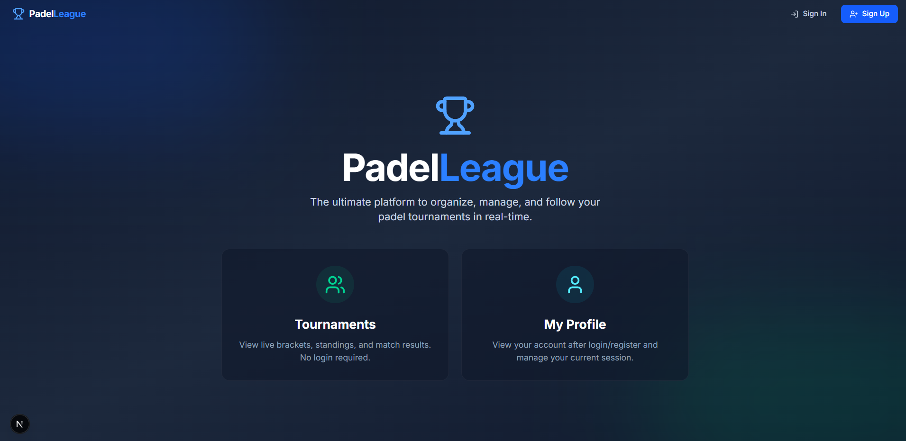
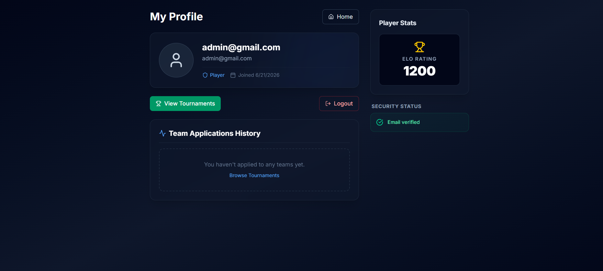
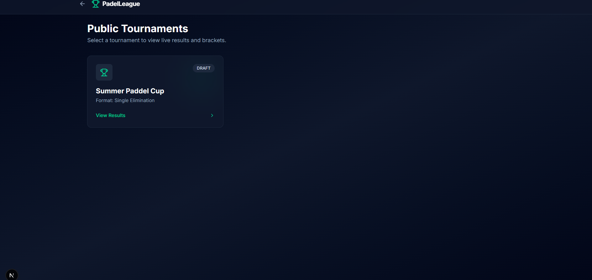
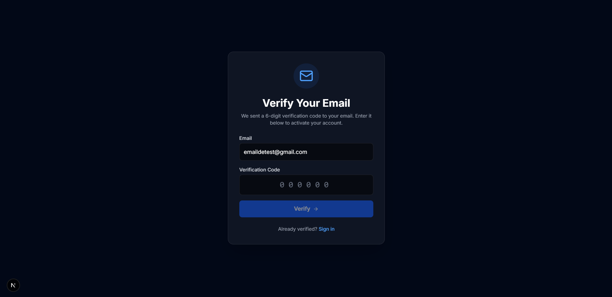

# 🎾 PadelLeague - Integrated Full-Stack System for Real-Time Tournament Management

PadelLeague is an advanced full-stack platform designed as a complete digital solution for organizing, managing, and tracking padel tennis competitions. The project utilizes a decoupled Client-Server architecture (Monorepo), featuring a robust Spring Boot backend and a dynamic Next.js frontend interface, all backed by a cloud-hosted relational database.

---

## 📸 Interface Preview

| 🏠 Main Landing Page | 👤 User Profile Dashboard |
| :---: | :---: |
|  |  |

| 🏆 Active Tournaments List | 📧 OTP Email Verification |
| :---: | :---: |
|  |  |

---

## 🎯 Core Features

### 🖥️ Administrative & Core Module
* **Automated Tournament Brackets**: Automatically generates match flows and brackets for both Single Elimination (knockout) and Round-Robin (league group stage) formats.
* **Structured Registrations**: Facilitates seamless team formation and registration (2 players per team) directly into active tournaments.
* **Dynamic ELO Rating System**: Automatically recalculates and updates player performance ratings instantly after a match score is submitted.
* **Live Standings & Leaderboards**: Displays real-time updated leaderboards tracking wins, losses, sets won, and overall points.

### 🚀 Advanced Modules & Security
* **Stateless Authentication**: Secured via JSON Web Tokens (JWT), implementing strict role-based access controls (ROLE_USER, ROLE_ADMIN, ROLE_ORGANIZER).
* **Real-Time Live Scores**: Employs Server-Sent Events (SSE) to push instantaneous score updates to spectator views without requiring a page refresh.
* **Secure Email Workflows**: Full support for account email verification (OTP validation) and password reset flows using dynamic Thymeleaf templates and Spring Mail.

---

## 🛠️ Tech Stack & Dependencies

### 🎨 Frontend (Client Layer)
* **Framework**: Next.js 16 (App Router) & React 19 (TypeScript)
* **Design & Styling**: Tailwind CSS v4 (Modern architecture with native Dark Mode support)
* **API Communication**: HTTP Client based on Axios

### ⚙️ Backend (Server Layer)
* **Core Core**: Spring Boot 4 + Spring Data JPA
* **Security & Auth**: Spring Security & jjwt (0.11.5) for secure token generation and filtering
* **Database**: PostgreSQL, fully hosted in the cloud via Supabase
* **Mailing**: Spring Mail Engine

---

## 🔌 API Contract (Auth Routes)

**Base URL:** http://localhost:8080/api

| Method | API Endpoint | Description |
|--------|--------------|-------------|
| POST   | /auth/login | Validates credentials and issues a secure JWT Bearer token |
| POST   | /auth/register | Handles new user account creation |
| POST   | /auth/forgot-password | Triggers a secure recovery token to the user's email |
| POST   | /auth/reset-password | Commits the new password into the database |

---

## 📂 Project Structure (Monorepo)

PadelLeague-FullStack
├── frontend/                  # Next.js Application (Runs on port 3000)
│   ├── public/                # Static assets, images, and SVG vectors
│   └── src/app/               # App Router pages, components, and hooks
│
├── liga-backend/              # Spring Boot API Service (Runs on port 8080)
│   ├── src/main/java/ro/ddc/liga/  # Business logic (Services, Controllers, Repositories)
│   └── Dockerfile             # Backend containerization blueprint
│
└── screenshots/               # Application UI captures included in documentation

---

## 🔧 Explicit Step-by-Step Local Setup Guide

Follow these detailed instructions to get both the backend server and frontend client up and running locally on your machine.

### Prerequisites
Before starting, ensure you have the following installed:
* Java Development Kit (JDK) 21 or newer
* Node.js (v18.x or newer) and npm
* A running PostgreSQL database client or a Supabase project instance

---

### Step 1: Clone the Repository
Open your terminal or command prompt, navigate to your desired directory, and execute the following commands:

    git clone https://github.com/USERNAME_TAU/PadelLeague-FullStack.git
    cd PadelLeague-FullStack

---

### Step 2: Configure and Launch the Backend Server (Spring Boot)

1. Open the project in your favorite IDE (e.g., VS Code or IntelliJ IDEA).
2. Navigate to the backend properties file located at:
   liga-backend/src/main/resources/application.properties
3. Update the database properties with your actual database credentials (local or Supabase instance):
   spring.datasource.url=jdbc:postgresql://your-database-host:5432/your-db-name
   spring.datasource.username=your-db-username
   spring.datasource.password=your-db-password
4. Open a terminal windows inside the backend directory:
   cd liga-backend
5. Build and run the Spring Boot application using the Maven wrapper:
   ./mvnw spring-boot:run
   (On Windows Command Prompt, use: mvnw spring-boot:run)
6. The backend server is now running and listening for requests on http://localhost:8080.

---

### Step 3: Configure and Launch the Frontend Client (Next.js)

1. Open a brand new terminal window (keep the backend server terminal running simultaneously).
2. Navigate to the frontend directory from the project root:
   cd frontend
3. Create a local environment configuration file named exactly `.env.local` inside the frontend folder.
4. Open the `.env.local` file and map the public API URL configuration pointing to your running backend:
   NEXT_PUBLIC_API_URL=http://localhost:8080/api
5. Install all required Node modules and dependencies specified in package.json:
   npm install
6. Spin up the local development server:
   npm run dev
7. The client application is now live! Open your preferred web browser and go to: http://localhost:3000

---
## 👥 Development Team
This project was developed in collaboration with:
- **Ciufu Alex** - [@BossMc3](https://github.com/BossMc3) (Frontend / Integration / ELO Logic)
- **[Eusebiu Fodor]** - [@euseby](https://github.com/euseby) (Backend Development / Java Spring Boot)
- **[Andrei Ciontea]** - [@anduciontea](https://github.com/anduciontea) (Database Design / Testing)

*The project was developed as part of the [Springathon / Hackathon] 2026.*
